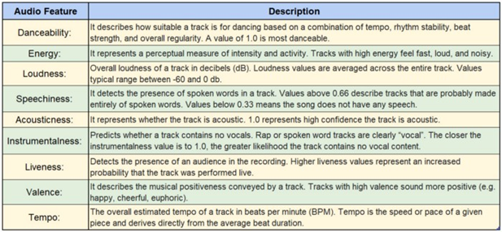

# Spotify Project
### A group project with the University of Birmingham Data Analytics Bootcamp (December 2021)

Spotify is an online streaming platform founded by Daniel Ek and Martin Lorentzon, in mid-2006. Spotify is currently the largest music streaming service across the globe, with almost 400 million monthly active users. 

The aim of this project was to explore what makes a song popular by analysing the top 100 streamed songs on the streaming platform Spotify. In order to collate the required data, the Spotify API was utilised to return JSON metadata about the artists’ name, tracks, streams (millions), followers, and various audio features, directly from the Spotify data catalogue. 

### Collating the Data

The final file was created using the spotify API to pull two dataframes:

 - [Track information](https://github.com/Amina-H1/spotify-project/blob/main/tracks.csv), pulled from a Spotify playlist of the top 100 streamed songs. This contains basic track information, such as artist/album name and release dates.
 - [Audio features](https://github.com/Amina-H1/spotify-project/blob/main/features.csv), pulled from the API's audio features function. This covers a wide range of information created using Spotify's own algorithms, such as danceability, acousticness, energy and valence (see Table 1, below). 

Finally, the number of streams was collected from [Wikipedia](https://en.wikipedia.org/wiki/List_of_most-streamed_songs_on_Spotify).

### Findings 1: Duration, Followers and Streams 

See: [Duration Boxplot](https://github.com/Amina-H1/spotify-project/blob/main/images/duration1.png):

The top 100 streamed songs on Spotify showed that the average duration was three and a half minutes long. Overall, the median for duration of the top 100 streamed songs was 3.50 minutes. The lower quartile for duration was 3.17 minutes long, whereas the upper quartile for duration was 3.90 minutes long. Therefore, the interquartile range of duration is 0.72 minutes.

See: [Duration vs Streams scatter plot](https://github.com/Amina-H1/spotify-project/blob/main/images/duration2.png):

As presented in the scatterplot above, the durations of the top 100 songs were compared against the number of streams they received.  The R squared value was 0.00026483 which indicates that there was no relationship between the two variables. As displayed, the songs longer than the average sometimes performs better than songs shorter than the average in terms of the number of streams, whereas sometimes the opposite was evident. 

To investigate the popularity of these songs further, the number of followers an artist has was considered as a result. 

See: [Duration vs Streams scatter plot](https://github.com/Amina-H1/spotify-project/blob/main/images/followers1.png):

In order to gain a better understanding of the factors which make the top 100 streamed songs on Spotify popular, it was important to measure the number of followers an artist has against the number of streams their songs achieve. As illustrated in the scatterplot above, the number of followers an artist has against the number of streams the songs achieved also showed weak correlation. The R squared value for these variables was 0.12358. One reason could be that there were some artists in the dataset with a one-off viral song. For example, as shown in [Table 2](https://github.com/Amina-H1/spotify-project/blob/main/images/followers.png), the artist of the third most streamed song has one of the lowest number of followers in the dataset. 

This also further indicated that there were other factors which the top 100 streamed songs have in common which show better correlation. Thus, a [Correlation Matrix](https://github.com/Amina-H1/spotify-project/blob/main/images/correlation_matrix.png) was created for the whole dataset to identify correlation coefficients between variables, which will be further explored below. 

### Findings 2: Loudness and Energy

Is there a correlation between the loudness of track and its energy?

Loudness: Overall Loudness of a track in decibels
Energy: Represents a perceptual measure of intensity and activity in a song

A Pearson’s Correlation test was chosen to measure the strength and direction of a potential linear correlation. See [Correlation Coefficient Value Table](https://github.com/Amina-H1/spotify-project/blob/main/images/correlation_table.png).

Hypothesis

(Null Hypothesis): There is no correlation between Loudness and Energy in the top 100 songs 
H0 : r = 0

(Alternative Hypothesis): There is a correlation between Loudness and Energy in the top 100 songs
H1: r != 0
Significant Level = 5% (0.05) (assumed)
Critical Value(p) = 0.195
r = 0.74
R^2 = 0.54 -> x100 = 54%. 

Thus, 54% of the variability in Loudness is explained by the variability in Energy. The remaining 46% is explained by the other variables that influence a track on the spotipy API. 

Conclusion:
We can conclude from this test that our results are significant as the r value is greater than the critical value, so we would reject the null hypothesis. Concluding that there is a relationship between Loudness of a track and the Energy of a track

